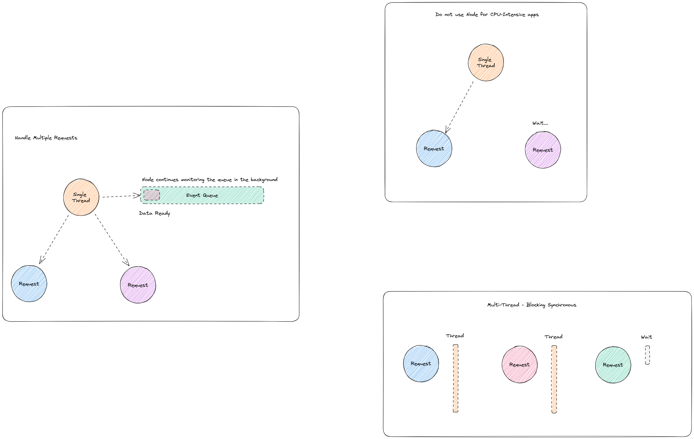

# How node.js works

- Node applications are Highly-scalable, data-intensive and real-time apps
- Non-blocking asynchronous 
- Handle multiple requests
- Node applications are asynchronous by default
- Node is ideal for I/O-intensive apps
- Do not use Node for CPU-intensive apps

### References
- https://www.youtube.com/watch?v=jOupHNvDIq8
- https://www.sbmadhav.com/7-steps-to-becoming-a-better-node-js-developer-42c2caca7d5d